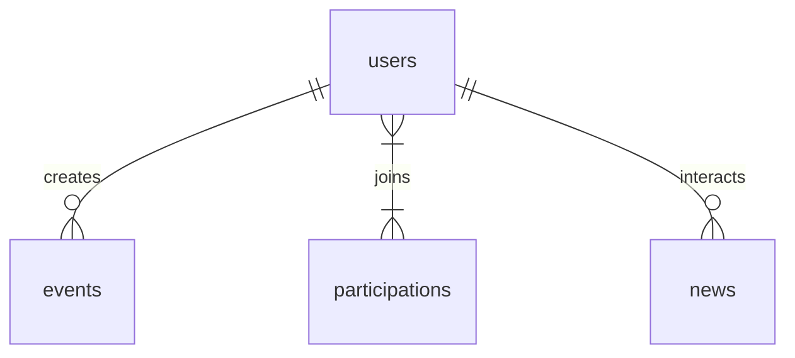

# ERD v1 - UniBlock Veritabanı Şeması (Text-based)

## Ana Varlıklar

### users
- id (PK)
- email, password_hash
- role (enum: ogrenci, kulup, proje_takimi, isletme, admin)
- department/faculty
- interests (array)
- profile_data (json)

### roles_permissions (many-to-many)
- role_id, permission_id

### events
- id (PK)
- title, description, date, location, capacity
- creator_id (FK users)
- status (draft, published, completed)

### participations
- id (PK)
- user_id, event_id, checkin_time, checkout_time, qr_code
- satisfaction_score

### news
- id (PK)
- title, summary, source, published_at, category
- relevance_score (personalized)

### interactions
- id (PK)
- user_id, target_type/id (event/news/post), type (like/comment/complain)

### messages
- id (PK)
- sender_id, receiver_id/group_id, content, timestamp

### sponsorships
- id (PK)
- business_id (FK users), target_id (event/kulup), status, score

## İlişkiler
- users 1:N events (creator)
- users N:M events (participations)
- users N:M news (interactions)
- users 1:N messages

## Mermaid ERD

**Not:** v1 - PostgreSQL varsayımı. Faz 1 sonrası migration script.
